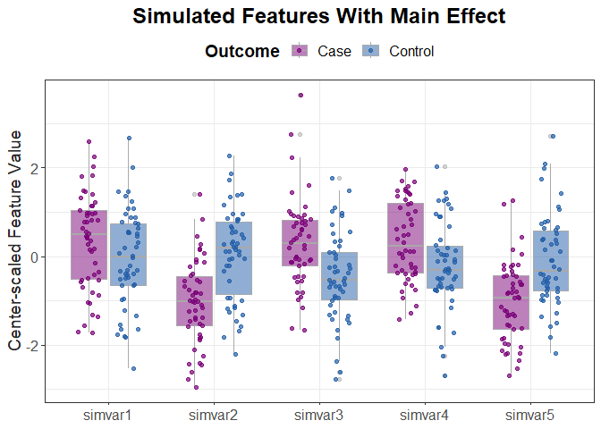

Simulated Datasets With Binary Outcomes
================
Bryan Dawkins
2024-09-07

- <a href="#create-a-simulated-dataset"
  id="toc-create-a-simulated-dataset">Create a simulated dataset</a>
  - <a href="#output-object" id="toc-output-object">Output Object</a>
  - <a href="#calculate-variable-importance"
    id="toc-calculate-variable-importance">Calculate Variable Importance</a>
  - <a href="#references" id="toc-references">References</a>

<head>
  <script id="MathJax-script" async src="https://cdn.jsdelivr.net/npm/mathjax@3/es5/tex-mml-chtml.js"></script>
</head>

``` r
library(knitr)
options(knitr.table.format = "html")
opts_chunk$set(message = FALSE, warning = FALSE, cache = FALSE)
```

``` r
tables <- captioner(prefix = "Table ", suffix = ". ", style = "b", style_prefix = TRUE, auto_space = FALSE)
figures <- captioner(prefix = "Figure ", suffix = ". ", style = "b", style_prefix = TRUE, auto_space = FALSE)

figures("interactionFig", "The simulation of gene expression data with differential co-expression network effects begins with a gene network with given connectivity and degree distribution, such as scale-free (Step 1). Initially the data set, with N genes and M subjects, has correlation structure that does not differ between groups (Step 2). A detailed algorithm for Step 2 is given in Figure 2. Briefly, the data set is initialized to a random Gaussian matrix, and then genes are changed to be proportional to others based on their connections in the adjacency matrix (Step 1). The strength of the correlation is regulated by a Gaussian (0, noise) variable, where smaller noise creates stronger correlation between genes. To create differentially co-expressed genes (Step 3), we arbitrarily split the M columns of data into two groups (cases and controls) and select random genes for permutation (red x’s) in the cases group. Note that this permutation is distinct from the permutation used to assess significance. This permutation keeps the simulated group means the same, so there are no main effects, but disrupts the wiring or correlation in the cases group between the target gene and the genes it was connected to in the adjacency matrix from Step 1. The co-expression in the healthy control group is left unchanged, resulting in a complex data set with an embedded differential co-expression network.", display = FALSE)
```

``` r
script_dir <- here::here(params$path_analysis, "scripts")
output_dir <- here::here(params$path_analysis, "output")
plot_dir <- here::here(params$path_analysis, "plots")
report_dir <- here::here(params$path_analysis, "reports")

source(here::here(script_dir, "main-effect_plus_interaction-effect_continuous-features_simulation.R"))
source(here::here(script_dir, "create_html_datatable.R"))
source(here::here(script_dir, "process_sim_yaml.R"))
```

``` r
sim_args <- process_sim_yaml(params)
```

# Create a simulated dataset

The following is an example where I am generating a simulated dataset
which can be used for assessing machine learning algorithm performance
in detecting features with significant main effects and interaction
effects, respectively, for a binary outcome (e.g., case-control). The
simulated dataset has 100 samples, and 100 total independent variables
(10% with significant statistical effect on the outcome). Out of the
total number of features with significant statistical effect, 50% will
have only a main effect and the remaining 50% will have only interaction
effect (no main effect).

Both main effects and interaction effects were generated using the
`createSimulation()` function in the `privateEC` R library. Main effects
were created by employing the following linear model:

$$X_{ij} = \beta_i y_i + \epsilon_{ij}\text{,}$$

where $X$<sub>ij</sub> is the value of the $i$<sup>th</sup> feature for the
$j$<sup>th</sup> sample instance, $\beta$$<sub>i</sub>$ is the coefficient of the
$i$<sup>th</sup> feature, $y$$<sub>i</sub>$ $\in$ {-1, 1} is the binary class of the
$j$^<sup>th</sup> sample instance, and $\epsilon$$<sub>ij</sub>$ $\sim$ $\mathcal{N}$(0, 1)
is random noise from a standard normal distribution.<sup>1</sup>

Interaction effects were based on a random graph (or network), where
connected features are differentially correlated between class groups,
exhibiting strong pairwise correlation in the ‘negative’ group (e.g.,
controls) but completely disrupted/destroyed correlation in the
‘positive’ group (e.g., cases); see Figure 1.<sup>2</sup>

``` r
knitr::include_graphics(here::here(plot_dir, "interaction-sim_fig.png"))
```

<div class="figure" style="text-align: left">


<p class="caption">
<strong>Figure 1.</strong> The simulation of gene expression data with differential
co-expression network effects begins with a gene network with given
connectivity and degree distribution, such as scale-free (Step 1).
Initially the data set, with N genes and M subjects, has correlation
structure that does not differ between groups (Step 2). A detailed
algorithm for Step 2 is given in Figure 2. Briefly, the data set is
initialized to a random Gaussian matrix, and then genes are changed to
be proportional to others based on their connections in the adjacency
matrix (Step 1). The strength of the correlation is regulated by a
Gaussian (0, noise) variable, where smaller noise creates stronger
correlation between genes. To create differentially co-expressed genes
(Step 3), we arbitrarily split the M columns of data into two groups
(cases and controls) and select random genes for permutation (red x’s)
in the cases group. Note that this permutation is distinct from the
permutation used to assess significance. This permutation keeps the
simulated group means the same, so there are no main effects, but
disrupts the wiring or correlation in the cases group between the target
gene and the genes it was connected to in the adjacency matrix from
Step 1. The co-expression in the healthy control group is left
unchanged, resulting in a complex data set with an embedded differential
co-expression network.
</p>

</div>

## Output Object

Columns named `simvar1`, `simvar2`, …, have either main effect or
interaction effect (but not both). The remaining columns, named `var1`,
`var1`, …, are just random Gaussian noise.

``` r
sim.dats <- do.call(sim_mixed_fn, sim_args)

head(sim.dats[, c(1:15, ncol(sim.dats))], n = 10) |> 
  mutate(across(where(is.numeric), ~round(.x, digits = 3))) |>
  flextable() |> 
  set_table_properties(align = "center")
```


## Calculate Variable Importance

Variable importance can be calculated in a multitude of different ways.
Here I am using a method called Nearest-neighbor Projected Distance
Regression (NPDR), which allows for hypothesis testing and a measure of
statistical significance (i.e., p-values), covariate adjustment (e.g.,
age, sex, ancestry, etc), in addition to feature selection using a LASSO
penalty.<sup>3</sup>

The output from `npdr()` is a dataframe with multiple columns. The
variable importance (`beta.Z.att`) is a standardized effect size, and
the corresponding p-value (`pval.att`) is calculated from a one-sided
hypothesis test; the bonferroni-adusted p-value (`pval.adj`) is also
present. As shown in the table below, the features with the largest
importance scores are those that were simulated to have a main effect or
interaction effect, respectively.

``` r
npdr_res <- npdr(outcome = "class",
                 dataset = sim.dats,
                 regression.type = "binomial",
                 attr.diff.type = "numeric-abs",
                 nbd.method = "relieff",
                 nbd.metric = "manhattan", 
                 knn = 0)

head(npdr_res, n = 15) |> 
  mutate(across(c(2,3, ncol(npdr_res)), ~format(.x, digits = 3))) |> 
  mutate(across(where(is.numeric), ~format(round(.x, digits = 3), nsmall = 3))) |>
  flextable() |> 
  set_table_properties(align = "center")
```


``` r
# Main Effect Features
plot_df <- sim.dats |> 
  select(all_of(c(paste0("simvar", 1:5), "class"))) |> 
  mutate(Outcome = factor(case_when(
    class == 1 ~ "Case",
    TRUE ~ "Control"
  ), levels = c("Case", "Control"))) |> 
  pivot_longer(cols = paste0("simvar", 1:5), values_to = "Center-scaled Feature Value", names_to = "Feature") |> 
  mutate(Feature = as.factor(Feature))

ggplot(plot_df, aes(x = Feature, y = `Center-scaled Feature Value`, color = Outcome, fill = Outcome, alpha = Outcome)) +
  geom_boxplot(color = "darkgray", alpha = 0.5) +
  geom_point(position = position_jitterdodge(seed = 1234), alpha = 0.7) +
  scale_color_manual(breaks = c("Case", "Control"), values = c("#7a0177", "#225ea8")) +
  scale_fill_manual(breaks = c("Case", "Control"), values = c("#7a0177", "#225ea8")) +
  theme_bw() + 
  ggtitle("Simulated Features With Main Effect") +
  theme(axis.title.x = element_blank(),
        legend.position = "top",
        legend.text = element_text(size = 12),
        legend.title = element_text(size = 14, face = "bold"),
        axis.text = element_text(size = 12),
        axis.title.y = element_text(size = 14, color = "#252525"),
        plot.title = element_text(size = 18, face = "bold", color = "black", hjust = 0.5))
```



## References

1.  Leek, J. T., and J. D. Storey. “Capturing Heterogeneity in Gene
    Expression Studies by Surrogate Variable Analysis.” PLoS Genet 3,
    no. 9 (Sep 2007): 1724-35.
    <https://dx.doi.org/10.1371/journal.pgen.0030161>.
2.  Lareau, C. A., B. C. White, A. L. Oberg, and B. A. McKinney.
    “Differential Co-Expression Network Centrality and Machine Learning
    Feature Selection for Identifying Susceptibility Hubs in Networks
    with Scale-Free Structure.” BioData Min 8 (2015): 5.
    <https://dx.doi.org/10.1186/s13040-015-0040-x>.
3.  Le, Trang T, Bryan A Dawkins, and Brett A McKinney.
    “Nearest-Neighbor Projected-Distance Regression (NPDR) for Detecting
    Network Interactions with Adjustments for Multiple Tests and
    Confounding.” Bioinformatics 36, no. 9 (2020): 2770-77. Accessed
    5/6/2022. <https://dx.doi.org/10.1093/bioinformatics/btaa024>.
